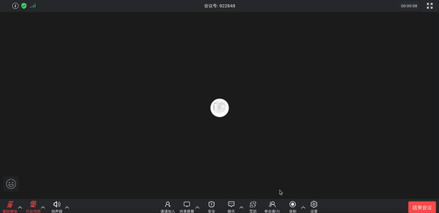
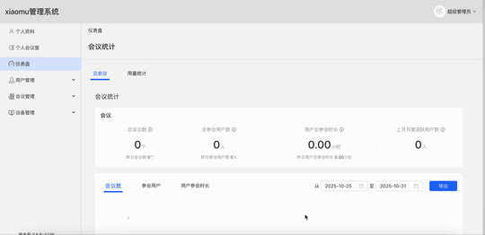
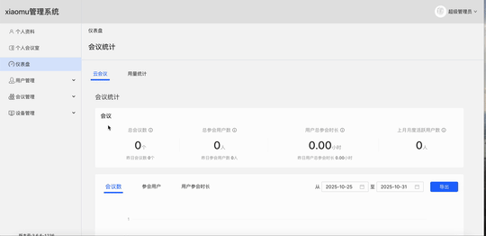

# xiaomu-meeting: 开源私有化视频会议解决方案

xiaomu-meeting 是一款开源的视频会议解决方案，旨在帮助企业和开发者**快速部署**一套完全**私有化**的、生产级的音视频会议服务。集成了实时多语言翻译功能，可实现**跨语言实时沟通**，打破国际会议的语言障碍。

我们将视频会议所需的核心技术（如分布式 MCU、音视频引擎、信令服务、智能翻译引擎）与易于操作的管理后台、Web 客户端打包成一个整体。这使得您无需从零开始拼凑复杂的组件，即可获得一套稳定、可靠且"开箱即用"的智能会议系统。

## 为什么选择 xiaomu-meeting？

*   **快速部署**：通过 Docker Compose，您可以在数分钟内完成整个服务的部署，极大地降低了技术门槛和运维成本。
*   **完全私有化**：所有服务和数据都部署在您自己的服务器上，确保了通信内容和用户信息的最高安全性和保密性。
*   **开源开放**：项目代码开源，您可以自由地进行二次开发或功能定制，将其深度集成到您现有的业务系统中。
*   **一站式方案**：提供了从服务端到客户端、从会议管理到后台监控的完整功能，是一套经过完整测试的“整车”方案，而非零散的“零件”。

## xiaomu-meeting 能做什么？

*   **企业通讯**：快速为企业部署私有化会议系统，保障内外部沟通的数据安全。
*   **业务集成**：将音视频能力集成至已有业务，为 OA、CRM 等系统增加实时沟通能力。
*   **行业应用**：作为企业级音视频基础设施，为企业提供统一的音视频通讯底座，可广泛应用于在线教育、远程培训、视频客服等场景。
*   **跨语言沟通**：内置智能翻译引擎，支持多语言实时翻译，自动生成会议字幕，打破国际会议的语言障碍。
*   **快速验证**：帮助您快速将关于实时音视频的创意变成现实，加速业务探索和市场验证。

---

> ## 开源版vs商业版功能对比
>
> | 功能模块           |                            开源版                            |                            商业版                            |
> | :----------------- | :----------------------------------------------------------: | :----------------------------------------------------------: |
> | **部署能力**       |                       支持单机部署<br>                       |         支持集群部署<br>支持云原生部署（Kubernetes）         |
> | **会议规模**       |                        支持 10 方会议                        |          支持超大会议（300 / 500 / 1000 / 2000）           |
> | **会议创建与管理** | 发起会议 / 预约会议<br>个人会议号<br>设置会议密码<br>邀请成员 | 发起会议 / 预约会议<br>个人会议号<br>设置会议密码<br>邀请成员 |
> | **屏幕共享**       |     共享屏幕（影音 / 图片 / 网页声音）<br>会议外共享屏幕     |     共享屏幕（影音 / 图片 / 网页声音）<br>会议外共享屏幕     |
> | **会控功能**       |         主持人 / 联席主持人控制<br>设置会议水印<br>          |  主持人 / 联席主持人控制<br>设置会议水印<br>支持会议等候室   |
> | **会议互动**       |         会议内聊天<br>签到 / 投票 / 公告 / 分组讨论          |         会议内聊天<br>签到 / 投票 / 公告 / 分组讨论          |
> | **录制与回放**     |            云端录制<br>录制文件预览与下载             |       云端录制<br>录制文件预览与下载        |
> | **数据统计与监控** |   会议数据仪表盘（资源使用 / 会议数据）<br>管理端会议控制    |   会议数据仪表盘（资源使用 / 会议数据）<br>管理端会议控制    |
> | **高级功能**       |                              —                               | 安全会议<br>量子加密会议<br>手机号注册 / 登录<br>企业 SSO 登录 |
> | **智能功能**       |                              —                               |             会议字幕<br>实时转写 / 自动会议纪要              |
> | **扩展会议类型**   |                              —                               |                    网络研讨会<br>大方会议                    |
> | **协作工具**       |                              —                               |               白板协作<br>文件 / 视频课件上传                |
> | **定制化支持**     |                              —                               |          提供定制服务开发（功能扩展 / 私有化集成）           |
> | **适用场景**       |                     小型团队 / 内部协作                      |              政企客户 / 教育培训 / 大型会议场景              |
>
> ---
>
> > 💡 说明：开源版适合中小团队自建部署，具备核心会议、录制、互动功能；  
> > 商业版在此基础上扩展了大规模集群能力、智能会议功能、安全加密与企业集成，并提供定制化开发与支持服务。

## 部署指南

本项目通过 **Docker Compose** 快速部署，以下为详细步骤。

### 前提条件

安装 xiaomu-meeting 之前, 请确保你的机器已满足最低安装要求：
- CPU >= 2 Core
- RAM >= 4 GiB

| 操作系统 | 软件 | 描述 |
|---------|------|------|
| Linux platforms | Docker 19.03 或更高版本<br>Docker Compose 1.28 或更高版本 | 请参阅[安装 Docker](https://docs.docker.com/engine/install/) 和[安装 Docker Compose](https://docs.docker.com/compose/install/) 以获取更多信息。

### 1. 克隆代码仓库

克隆 xiaomu-meeting 源代码至本地环境。

```bash
git clone https://github.com/Angk02/xiamu-meeting.git --branch main
```

### 2. 启动服务

首先，进入 xiaomu-meeting 源代码的目录。
```bash
cd xiaomu-meeting
```

然后，复制环境配置文件。
```bash
cp .env.example .env
```
**重要提示：** 启动服务前，请务必根据您的实际部署环境修改 `.env` 文件，例如域名、内网 IP、公网 IP 等配置。

最后，启动 Docker 容器。根据您系统上的 Docker Compose 版本，选择合适的命令来启动容器。您可以通过 `docker compose version` 命令检查版本。

如果版本是 **Docker Compose V2**，使用以下命令：
```bash
docker compose up -d
```

如果版本是 **Docker Compose V1**，使用以下命令：
```bash
docker-compose up -d
```

运行命令后，您应该会看到类似以下的输出，显示所有容器正在启动：
```
[+] Running 33/33
 ✔ Network xiaomu-meeting_videoconferencing     Created
 ✔ Container mysql                              Started
 ✔ Container redis                              Started
 ✔ Container nats                               Started
 ✔ Container rabbitmq                           Started
 ✔ Container mongodb                            Started
 ...
 ✔ Container admin                              Started
 ✔ Container nginx                              Started
```

### 3. 检查容器状态

您可以通过以下命令检查是否所有容器都正常运行：
```bash
docker compose ps
```
在这个输出中，您应该可以看到包括多个业务服务如 `api`, `web`, `admin`, `master` 等, 以及 `mysql`, `redis`, `nginx` 等基础组件。一个健康的容器状态应为 `Up` 或 `running`。

### 4. 防火墙配置

如果服务需要对外网暴露，请确保防火墙或安全组已放开以下端口：
- **TCP**: 443, 1443, 2443
- **UDP**: 10000, 10001

### 5. 访问地址
服务启动成功后，您可以通过以下地址访问：
- **Web 用户端**：`https://${DOMAIN_OR_PUBLICIP}/`
- **Web 管理端**：`https://${DOMAIN_OR_PUBLICIP}/admin/`
- **默认超级管理员账号/密码**：`18888888888/xiaomu123`
- **添加用户默认密码**：`xiaomu123`

---

## 使用指南

### 1. 登录


### 2. 快速开启一场会议


### 3. 开启云录制、预览和下载



### 4. 后台管理添加用户



### 5. 后台管理批量导入用户


